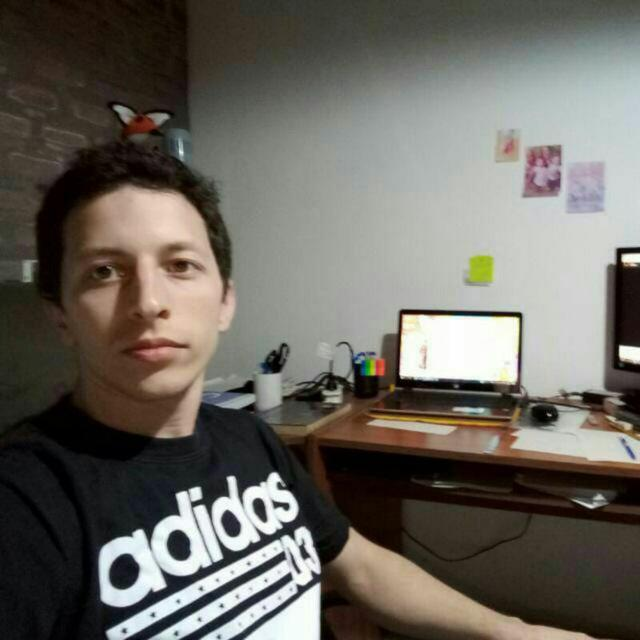

# 💎 Portfolio

Este proyecto presenta el portafolios de Emanuel.

## 🔍 Vistas 

### 💻 Desktop y 📱 Mobile

Puedes verlo [aquí](https://epontoni.github.io/portfolio/).

## 📌 Stack

## 🌟 Autor

* **Emanuel Pontoni**  - [@epontoni](https://github.com/epontoni)
